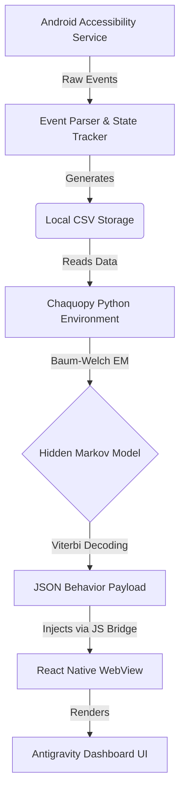

  
  
  <h1>Reelio</h1>
  
<b>Continuous Latent State Engine for Behavioral Analytics</b>

  
<i>A privacy-first, on-device Android application for passively tracking, modeling, and visualizing short-form content consumption (doomscrolling) using Hidden Markov Models.</i>

  

    <a href="#overview">Overview</a> •
    <a href="#core-features">Features</a> •
    <a href="#technical-architecture">Architecture</a> •
    <a href="#the-behavioral-model-hmm">The Model</a> •
    <a href="#uiux-design-system">UI/UX</a> •
    <a href="#installation--setup">Installation</a>
  

---

## 📖 Overview

**Reelio** (formerly InstaTracker) is an experimental Android application designed to study and visualize user behavior on short-form video platforms (like Instagram Reels). Instead of simply tracking screen time, Reelio employs an **Accessibility Service** to passively monitor micro-interactions (dwell times, scroll velocities, swipe patterns) without requiring root access or interfering with the user experience.

The core innovation of Reelio lies in its **on-device Behavioral Engine**. It utilizes a **Hidden Markov Model (HMM)** executed natively via Chaquopy to classify user states into two latent categories:
1. **Casual Browsing (State 0):** High turnover, intentional skipping, shorter dwell times.
2. **Captured / Doomscrolling (State 1):** High inertia, extended continuous viewing, loss of temporal awareness.

All data processing, model training (Baum-Welch Expectation-Maximization), and state decoding (Viterbi) happen entirely on the device. Data never leaves the phone. 

## ✨ Core Features

### 🔍 Passive Telemetry Tracking
*   **Accessibility Integration:** Hooks into Android's Accessibility APIs to detect scroll events, view changes, and app foreground/background states.
*   **Micro-Interaction Logging:** Calculates precise dwell time per video, scrolling speed, and session contiguousness.
*   **Privacy-First CSV Storage:** Raw telemetry is heavily anonymized and stored locally on the device (`insta_data.csv`).

### 🧠 On-Device Machine Learning
*   **Chaquopy Integration:** Runs native Python data science libraries (NumPy, Pandas) directly within the Android lifecycle.
*   **Baum-Welch Optimization:** The HMM dynamically trains itself on the user's specific historical baseline, adapting its parameters over time.
*   **Viterbi Path Decoding:** Infers the hidden psychological state (Casual vs. Captured) for every single video watched.

### 🌌 Antigravity UI Dashboard (React + WebView)
*   **Mobile-First React Layer:** A high-performance Javascript dashboard injected seamlessly into an Android WebView.
*   **Cognitive Stability Score:** A composite index metric quantifying the user's resilience against algorithmic capture.
*   **Behavior Timeline Playback:** An interactive scrubber allowing users to replay their scrolling sessions, visualizing exactly when they slipped into a "Captured" state.
*   **State Dynamics Matrix:** A 2x2 transition matrix visualizing the mathematical probability of escaping a doomscrolling state vs. remaining captured.
*   **Risk Heatmap:** A 14-day calendar view identifying the times of day/week most vulnerable to algorithmic capture.

---

## 🏗️ Technical Architecture

Reelio bridges native Android systems with embedded Python processing and a modern web frontend.

### 1. Android Native Layer (Kotlin)
*   `MainActivity.kt`: The primary control panel. Handles permissions, Accessibility Service toggling, real-time metric summaries, and data export.
*   `InstaAccessibilityService.kt`: The background worker. Parses Android `AccessibilityEvent` streams to detect when Instagram Reels are active, measuring dwell time and sequence.
*   `DashboardActivity.kt`: The WebView container. Manages the execution context of the Python scripts and safely injects the resulting JSON into the React frontend.

### 2. Python Analytics Engine (Chaquopy)
*   `hmm.py`: The orchestrator. Loads CSV data, applies log-transformations to dwell times, bounds historical processing (last 50 sessions for mobile CPU optimization), and runs the EM algorithm.
*   `forward_backward.py` & `viterbi.py`: Custom implementations of HMM algorithms adjusted for bivariate Gaussian emissions (Log Dwell + Scroll Velocity) and temporal decay ($\Delta t$) between disconnected sessions.

### 3. Frontend Dashboard (React + Tailwind)
*   `index.html` & `app.jsx`: A self-contained React application utilizing Babel standalone and Recharts. Designed to run offline without external API dependencies.

---

## 🧮 The Behavioral Model (HMM)

Reelio doesn't just track time; it tracks *inertia*. The Hidden Markov Model is initialized with domain-specific assumptions about doomscrolling:

*   **State 0 (Casual):** Lower mean dwell time ($\mu_0$), narrower variance ($\sigma_0$), low probability of remaining in the state ($A_{00}$).
*   **State 1 (Captured):** Higher mean dwell time ($\mu_1$, representing algorithmic lock-in), high probability of remaining in the state ($A_{11}$, demonstrating high friction to exit).

**Performance Optimizations:**
To run complex Expectation-Maximization on mobile CPUs without UI blocking, the HMM is optimized:
*   Max EM iterations capped.
*   Convergence tolerances relaxed.
*   Data window bounded to the most relevant recent history.
*   Results in a `< 2 second` execution time on standard Android hardware.

---

## 🎨 UI/UX Design System: "Antigravity"

The dashboard and native activities are built using a bespoke design specification known as the **Antigravity UI**.

*   **Vibe:** A "Cognitive Observatory." It feels like a piece of serious, custom-engineered laboratory equipment rather than a generic productivity app.
*   **Color Palette:**
    *   `Background Primary`: `#0B1220` (Deep Void)
    *   `Card Surface`: `#1A2333` (Glassmorphism base)
    *   `Cyan Accent`: `#22D3EE` (Primary interaction and data mapping)
    *   `Warning/Danger`: `#FBBF24` / `#F87171` (Used strictly for indicating high-capture risk states)
*   **Typography:** Strict use of `Inter` for highly legible, dense data presentation. Heavy use of uppercase, widely tracked overlines for microscopic telemetry labels.
*   **Micro-interactions:** Cards feature subtle `translateY(-2px)` lifts and cyan-tinted box-shadows on interaction, creating a responsive, fluid feel.

---

## ⚙️ Installation & Setup

### Prerequisites
*   Android Studio (Iguana or later recommended).
*   Android device running SDK 28+ (Android 9 Pie or higher).
*   **Chaquopy Plugin**: Ensure your `local.properties` is configured correctly for Chaquopy if building from source.

### Build Instructions
1. Clone the repository: `git clone https://github.com/yourusername/Reelio.git`
2. Open the project in Android Studio.
3. Sync Gradle files.
4. Build and deploy to your Android device: `./gradlew assembleDebug`

### Permissions Required
Upon first launch, Reelio requires:
1.  **Accessibility Permissions:** To monitor screen content and scroll events (Settings > Accessibility > Installed Apps > Reelio).
2.  **Notification Permissions (Android 13+):** To run the foreground service reliably.

### Usage
1. Open Reelio and grant necessary permissions. The System Status should read "Active & Monitoring".
2. Open Instagram and navigate to the Reels tab.
3. Scroll naturally. Reelio passively logs the telemetry.
4. Return to Reelio and tap **View Behavioral Dashboard** to see the HMM decode your psychological state in real-time.

---

  
<i>Developed for Behavioral Dynamics Research.</i>

